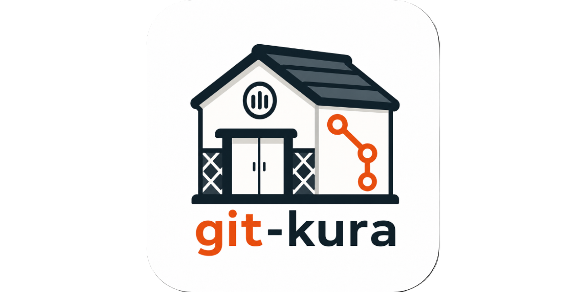

# git-kura


[](https://github.com/tooppoo/git-kura/actions/workflows/ci.yml)
[](https://codecov.io/gh/tooppoo/git-kura)
[](https://opensource.org/licenses/Apache-2.0)



`git-kura` is a conflict-aware keyed worktree coordinator for Git.

It helps humans, AI coding agents, and reviewers run multiple task-specific worktrees in parallel while detecting and preventing conflicting edits early.


## Why Kura?

Multi-agent development becomes fragile when several agents work against the same repository at the same time.

Typical failure modes are:

* an agent edits the wrong worktree because the path was selected manually;
* a reviewer inspects a different checkout from the one used by the implementer;
* two agents independently modify the same files and only discover the conflict at merge time;
* a local hook, skill file, or tool setup drifts across worktrees and agents.

Kura addresses these failure modes with two small primitives:

* **keyed worktrees**: one stable key resolves to one deterministic branch and worktree;
* **path seals**: a task claims the repository-relative paths it intends to edit, so other tasks can detect the overlap before editing, committing, or merging.

Kura would makes it easier to delegate multiple tasks to AI agents without manually reasoning about every possible conflict up front. If a worktree is likely to conflict with another active task, Kura can stop it before changes are made.

## Quick Start

Install the latest release:

```sh
curl -fsSL https://raw.githubusercontent.com/tooppoo/git-kura/main/install.sh | sh
```

This installs `git-kura` into `~/.local/bin`. See [docs/installation.md](docs/installation.md) for version pinning, custom install directories, checksum verification, and other installation methods(i.e. Windows).

It is recommended to install repository-local safety helpers:

```sh
git kura tools install pre-commit claude-skill codex-skill
```

The `pre-commit` component rejects commits whose staged files conflict with another task's path seals. The `claude-skill` and `codex-skill` components install agent instructions into the repository so agents can use Kura consistently.

## Design principles

Kura（`蔵`） is built around these ideas:

* **The key is the source of truth**: humans and agents should not need to remember worktree paths manually.
* **Worktree isolation**: each key gets its own Git worktree and branch.
* **Early conflict detection**: path seals make intended edits visible before implementation, commit, or merge.
* **Script- and agent-friendly output**: commands support plain output for shell scripts, JSON for structured tools, and TOON for AI prompts.
* **Repository-local state**: Kura stores worktree metadata, path seals, and tool metadata in repository-local Git state.
* **Safety over convenience**: destructive operations are conservative and should stop rather than silently discard or overwrite user work.

Kura is intentionally small. It is not a Git client, an AI session manager, a pull request tool, an issue tracker client, or a project management tool.

## Parallel worktree workflow

A typical multi-agent workflow is:

```sh
# Agent A
git kura open issue-54
cd "$(git kura get issue-54)"
git kura seal claim README.md
# edit, test, commit

# Agent B
git kura open issue-55
cd "$(git kura get issue-55)"
git kura seal test README.md   # fails before Agent B edits a path claimed by issue-54
```

When the task is ready, resolve the key back to the correct branch and worktree:

```sh
cd "$(git kura get issue-54 --root)"
git merge "$(git kura get issue-54 --branch)"
git kura close issue-54
```

`git kura close <key>` removes the managed worktree and branch and releases every path seal held by that key.

## Core commands

```sh
git kura open <key>             # create a worktree and branch for a task key
git kura open <key> --dry-run   # inspect planned branch/path without side effects
git kura get <key>              # print the worktree path
git kura get <key> --branch     # print the branch name
git kura get <key> --root       # print the repository root
git kura get <key> --json       # print structured JSON
git kura get <key> --toon       # print TOON for AI prompts
git kura ls                     # list open Kura worktree keys
git kura close <key>            # remove a managed worktree and release its seals
```

See [docs/commands.md](docs/commands.md) for the full command reference.

## Path seals

Path seals are repository-wide claims stored in the Git common dir and shared by all worktrees of the same repository.

```sh
git kura seal claim <path...>    # claim paths for the current worktree key
git kura seal unclaim <path...>  # release paths claimed by the current worktree key
git kura seal test <path...>     # read-only conflict check for the current worktree key
git kura seal ls [key]           # inspect claimed paths
git kura seal doctor             # validate the seal store
```

`seal claim`, `seal unclaim`, and `seal test` derive the current key from the Kura-managed worktree they run in. They do not rely on process-local state or an environment variable, which makes them suitable for fresh shell invocations used by coding agents.

A path is safe when it is unclaimed or already claimed by the current key. A path claimed by another key is a conflict.

## Tool components

Kura can install repository-local helper components:

```sh
git kura tools status
git kura tools install pre-commit
git kura tools install claude-skill
git kura tools install codex-skill
git kura tools install --all
git kura tools uninstall <component...>
```

Available component IDs are:

* `pre-commit`: installs a repository-local hook that runs path-seal checks against staged files;
* `claude-skill`: installs `.claude/skills/git-kura/SKILL.md`;
* `codex-skill`: installs `.agents/skills/git-kura/SKILL.md`.

Tool components are installed from the tools release archive that matches the running binary's release version. The archive checksum is verified before extraction. Existing user-modified or unmanaged files are not overwritten.


## Documentation

* [Installation](docs/installation.md)
* [Commands](docs/commands.md)
* [Seal commands: context and scope](docs/commands/seal-commands.md)
* [Output formats](docs/output-format.md)
* [State management](docs/state-management.md)
* [Design](docs/design.md)
* [Architecture decision records](docs/adr/)

## License

Apache License 2.0

## Related

### DevContainer

- https://github.com/tooppoo/catalog-devcontainer-features

### Windows Release

- https://github.com/tooppoo/catalog-scoop-bucket
- https://github.com/tooppoo/winget-pkgs
- https://github.com/russellbanks/Komac
- https://github.com/microsoft/winget-pkgs
